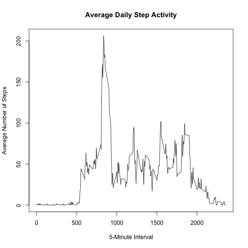
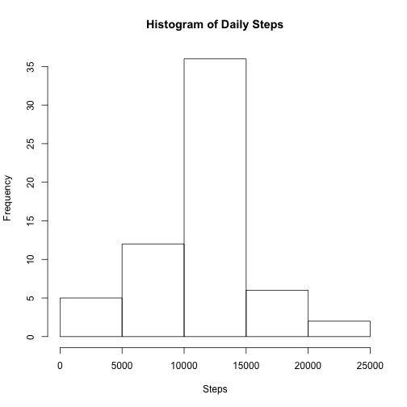
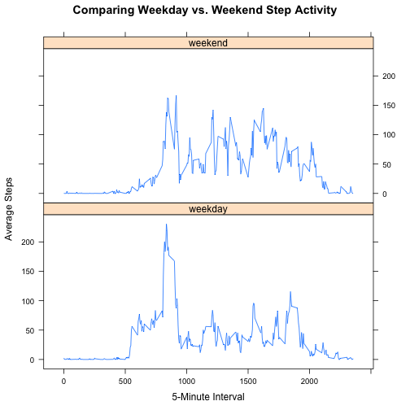

## Loading and preprocessing the data


```r
library(lubridate)
df <- read.csv("activity.csv")
df$date <- ymd(df$date)
```

## What is mean total number of steps taken per day?

Note: NA values will be discarded.


```r
library(dplyr)
by_date <- group_by(df, date)
daily_steps <- summarize(by_date, steps=sum(steps, na.rm=TRUE))
mean_steps_na_rm <- mean(daily_steps$steps)
median_steps_na_rm <- median(daily_steps$steps)
paste("Mean steps (NA discarded):",round(mean_steps_na_rm,digits=2))
```

```
## [1] "Mean steps (NA discarded): 9354.23"
```

```r
paste("Median steps (NA discarded):",median_steps_na_rm)
```

```
## [1] "Median steps (NA discarded): 10395"
```

## What is the average daily activity pattern?

Summzarize the data across daily 5-minute intervals by computing the
average number of steps for each interval (with NA values discarded).


```r
by_interval <- group_by(df,interval)
avg_steps <- summarize(by_interval, steps=mean(steps, na.rm=TRUE))
with(avg_steps, {
    plot(interval,steps,type="l",
         main="Average Daily Step Activity",
         xlab="5-Minute Interval",
         ylab="Average Number of Steps")
})
```

 

#### The 5-minute interval with the highest daily average step count


```r
avg_steps[(avg_steps$steps==max(avg_steps$steps)),]
```

```
## Source: local data frame [1 x 2]
## 
##   interval    steps
## 1      835 206.1698
```

## Imputing missing values

#### Print a summary of the data to see where data is missing

```r
summary(df)
```

```
##      steps             date               interval     
##  Min.   :  0.00   Min.   :2012-10-01   Min.   :   0.0  
##  1st Qu.:  0.00   1st Qu.:2012-10-16   1st Qu.: 588.8  
##  Median :  0.00   Median :2012-10-31   Median :1177.5  
##  Mean   : 37.38   Mean   :2012-10-31   Mean   :1177.5  
##  3rd Qu.: 12.00   3rd Qu.:2012-11-15   3rd Qu.:1766.2  
##  Max.   :806.00   Max.   :2012-11-30   Max.   :2355.0  
##  NA's   :2304
```

#### Print the number of missing steps

```r
paste("There are",sum(is.na(df$steps)),"records missing values")
```

```
## [1] "There are 2304 records missing values"
```

#### Impute the missing values by using the average for a given interval

```r
fill_missing_steps <- function(steps,interval) {    
    if(is.na(steps)) {
        avg_steps[avg_steps$interval==interval,2][[1]]
    }
    else {
        steps
    }
}
imputed_df <- df
imputed_df$steps <- mapply(fill_missing_steps, imputed_df$steps, imputed_df$interval)
```

#### Show that the imputed data set is complete

```r
summary(imputed_df)
```

```
##      steps             date               interval     
##  Min.   :  0.00   Min.   :2012-10-01   Min.   :   0.0  
##  1st Qu.:  0.00   1st Qu.:2012-10-16   1st Qu.: 588.8  
##  Median :  0.00   Median :2012-10-31   Median :1177.5  
##  Mean   : 37.38   Mean   :2012-10-31   Mean   :1177.5  
##  3rd Qu.: 27.00   3rd Qu.:2012-11-15   3rd Qu.:1766.2  
##  Max.   :806.00   Max.   :2012-11-30   Max.   :2355.0
```

#### Make a histogram of steps taken each day


```r
by_date <- group_by(imputed_df,date)
total_steps <- summarize(by_date, steps=sum(steps))
hist(total_steps$steps,main="Histogram of Daily Steps",xlab="Steps")
```

 

#### Calculate the mean and median of total steps per day


```r
imputed_mean <- mean(total_steps$steps)
imputed_median <- median(total_steps$steps)

paste("The daily mean step count with imputed values was",
      round(imputed_mean,digits=2),
      "steps which is greater than the daily mean of",
      round(mean_steps_na_rm,digits=2),
      "steps calculated with NA values excluded.")
```

```
## [1] "The daily mean step count with imputed values was 10766.19 steps which is greater than the daily mean of 9354.23 steps calculated with NA values excluded."
```

```r
paste("The daily median step count with imputed values was",
      round(imputed_median,digits=2),
      "steps which is greater than the daily median of",
      median_steps_na_rm,
      "steps calculated with NA values excluded.")
```

```
## [1] "The daily median step count with imputed values was 10766.19 steps which is greater than the daily median of 10395 steps calculated with NA values excluded."
```


## Are there differences in activity patterns between weekdays and weekends?

#### Create ``weekend`` and ``weekday`` factor variables for each record


```r
library(lattice)
lbl_date <- function(x) {
    wday <- weekdays(x)
    if(wday==c("Saturday") | wday==c("Sunday")) {
        c("weekend")
    }
    else {
        c("weekday")
    }
}
imputed_df$wday <- mapply(lbl_date, imputed_df$date)
imputed_df$wday <- as.factor(imputed_df$wday)
```

#### Average the data by interval and weekend/weekday factors


```r
wday_by_interval <- group_by(imputed_df,interval,wday)
wday_avg_steps <- summarize(wday_by_interval, steps=mean(steps))
```

#### Compare weekday vs. weekend activity with a plot of average steps per interval


```r
xyplot(wday_avg_steps$steps~wday_avg_steps$interval|wday_avg_steps$wday,
       type="l",
       main="Comparing Weekday vs. Weekend Step Activity",
       xlab="5-Minute Interval",
       ylab="Average Steps",
       layout=c(1,2))
```

 
    
